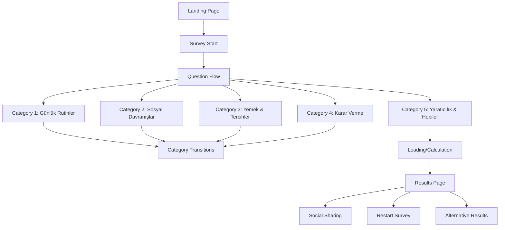
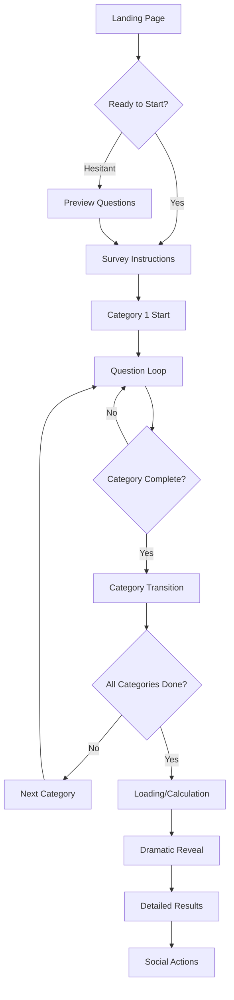
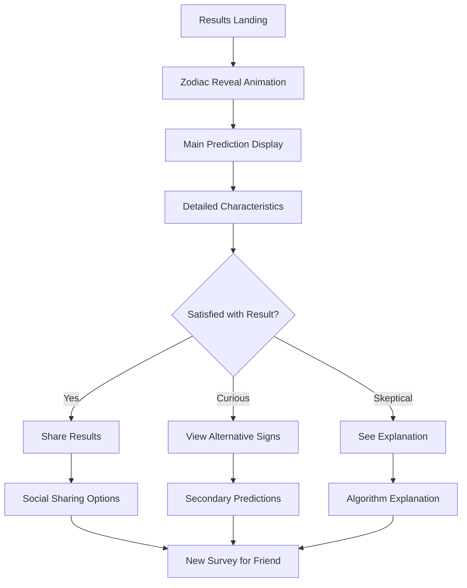

# Zodiac Predictor UI/UX Specification

## Introduction

This document defines the user experience goals, information architecture, user
flows, and visual design specifications for Zodiac Predictor's user interface.
It serves as the foundation for visual design and frontend development, ensuring
a cohesive and user-centered experience.

### Overall UX Goals & Principles

#### Target User Personas

**Primary User: Modern Mystical Explorer**

- Demographics: 18-35 yaş, çoğunlukla kadın kullanıcılar, sosyal medya aktif
- Behaviors: Burç içerikleriyle etkileşim, kişilik testleri yapma, sonuçları
  paylaşma
- Needs: Eğlenceli ve kişiselleştirilmiş deneyimler, estetik ve Instagram-worthy
  content
- Goals: Kendini tanıma, arkadaşlarla eğlenceli aktiviteler, sosyal validation

**Secondary User: Curious Skeptic**

- Demographics: 25-40 yaş, teknoloji meraklıları, erkek kullanıcılar dahil
- Behaviors: Algoritmaları merak etme, test sonuçlarını sorgulama
- Needs: Mantıklı açıklamalar, algoritma şeffaflığı
- Goals: Sistemi anlama, eğlenirken öğrenme

#### Usability Goals

- **Completion Rate**: %85+ kullanıcı tüm soruları tamamlamalı
- **Engagement**: Ortalama oturum süresi 12+ dakika (50+ soru için ideal)
- **Mobile Experience**: Touch targets 44px minimum, thumb-friendly navigation
- **Loading Tolerance**: 3 saniye max initial load, 1 saniye max question
  transitions
- **Retention**: %40+ kullanıcı ikinci test için geri dönmeli

#### Design Principles

1. **Feminine Mystique over Technical Precision** - Pembe tonları ve soft
   aesthetics ile büyülü atmosfer, sert teknoloji görünümü yerine
2. **Progressive Enchantment** - Her soru kullanıcıyı daha da meraklandırmalı,
   "next question" anticipation
3. **Mobile-First Magic** - Tüm etkileşimler önce mobil için optimize, sonra
   desktop
4. **Micro-Moment Delight** - Her tap, swipe, transition'da küçük sürprizler
5. **Social-Ready Design** - Her ekran screenshot-worthy, paylaşılabilir

### Change Log

| Date       | Version | Description                 | Author          |
| ---------- | ------- | --------------------------- | --------------- |
| 2024-07-24 | 1.0     | Initial UI/UX specification | UX Expert Sally |

## Information Architecture (IA)

### Site Map / Screen Inventory

### Navigation Structure

**Primary Navigation:** Single-path flow design, no traditional navigation menu
needed

- Survey flow is linear and guided
- Back button for previous questions (limited to current category)
- Exit/restart options accessible but not prominent

**Secondary Navigation:** Contextual actions based on current state

- Progress indicators as navigation reference
- Category transitions as micro-navigation moments
- Results page secondary actions (share, retry, explore)

**Breadcrumb Strategy:** Progress-based breadcrumbs

- "Soru 15/52" instead of traditional breadcrumbs
- "Günlük Rutinler" category indicator
- Visual progress bar as primary orientation tool

## User Flows

### Primary Flow: Complete Zodiac Survey

**User Goal:** Discover my zodiac sign through personality questions

**Entry Points:**

- Landing page CTA button
- Social media shared links
- Direct URL access

**Success Criteria:** User completes all categories and receives zodiac
prediction with satisfaction

#### Flow Diagram

#### Edge Cases & Error Handling:

- **Accidental Exit**: "Cevapların kaybolacak, emin misin?" confirmation
- **Network Issues**: Offline mode "Bağlantı koptu, tekrar deneyelim" with retry
- **Incomplete Answers**: Gentle prompts "Bu soruyu atlayalım mı?" option
- **Time Outs**: Session recovery "Kaldığın yerden devam et" capability
- **Server Errors**: Graceful degradation "Sihir biraz aksadı, yeniden
  hesaplıyoruz"

**Notes:** Flow designed for maximum completion rates with engaging
micro-interactions at each step.

### Secondary Flow: Results Exploration

**User Goal:** Understand and share my zodiac prediction results

**Entry Points:** Directly after survey completion, shared result links

**Success Criteria:** User engages with results and potentially shares or
retakes survey

#### Flow Diagram

#### Edge Cases & Error Handling:

- **Low Confidence Results**: "Sonuçların kesin değil, tekrar deneyelim mi?"
  retry suggestion
- **Tie Situations**: "İki burç arasında kaldın!" special handling
- **Sharing Failures**: "Paylaşım şu an mümkün değil" with copy-link fallback
- **Results Loading Errors**: "Sihir tamamlanamadı" with restart option

## Wireframes & Mockups

### Design Files

**Primary Design Tool:** Figma workspace for high-fidelity mockups **Design
System:** Component library with pink-gold mystical theme **Responsive
Breakpoints:** Mobile-first approach with tablet and desktop adaptations

### Key Screen Layouts

#### Landing Page

**Purpose:** Welcome users and encourage survey start with mystical pink theme

**Key Elements:**

- Hero section: "Burcunu Tahmin Edebilirim ✨" with pink gradient background
- Mystical illustration: Stars, moons, constellations in pink/gold tones
- Primary CTA: "Sihri Başlat" button with pink-to-gold gradient
- Credibility: "50+ kişilik sorusuyla %87 doğruluk" subtitle
- Social proof: "12.5K+ kişi burcunu öğrendi" counter

**Interaction Notes:**

- Floating star animations on background
- CTA button hover: pink glow effect
- Mobile: Full-screen hero with thumb-accessible CTA

#### Question Flow Screen

**Purpose:** Present individual questions with engaging pink UI

**Key Elements:**

- Progress bar: Pink gradient showing completion percentage
- Category indicator: "Günlük Rutinler • 3/12" in soft pink badge
- Question card: White card with pink border, shadow effects
- Answer options: Pink radio buttons, hover states with gold accents
- Navigation: "İleri" button in pink gradient, "Geri" in outline style

**Interaction Notes:**

- Card flip animation between questions
- Selected answer: pink highlight with checkmark icon
- Loading shimmer between categories in pink tones
- Mobile: Large touch targets, swipe gestures supported

#### Results Reveal Screen

**Purpose:** Dramatic zodiac sign revelation with pink mystical theme

**Key Elements:**

- Constellation animation: Stars forming zodiac symbol in pink/gold
- Main announcement: "SEN BİR AKREP'SİN!" in large pink typography
- Confidence meter: "Emin: %87" with pink progress circle
- Zodiac symbol: Large illustration in pink-gold gradient
- Share button: "Sonuçlarımı Paylaş" prominent pink CTA

**Interaction Notes:**

- Typewriter effect for main text
- Pulsing animation on zodiac symbol
- Confetti animation in pink/gold colors
- Mobile: Portrait-optimized layout for social sharing

#### Detailed Results Screen

**Purpose:** Comprehensive zodiac information and engagement options

**Key Elements:**

- Zodiac characteristics: Pink-bordered cards with trait descriptions
- Personalized insights: "Senin Akrep özeliklerin" section with pink highlights
- Alternative suggestions: "Başka olabileceğin burçlar" in smaller cards
- Action buttons: "Tekrar Test Et", "Arkadaşın İçin Yap" in pink theme
- Explanation section: "Nasıl vardık?" with pink accordion UI

**Interaction Notes:**

- Expandable/collapsible trait cards
- Smooth scrolling between sections
- Pink loading states for alternative calculations
- Social sharing modal with pink-themed options

## Component Library / Design System

### Design System Approach

**Custom Design System:** Pink Mystique - tailored for zodiac prediction app
with feminine mystical aesthetics

### Core Components

#### Question Card Component

**Purpose:** Display individual survey questions with consistent pink styling

**Variants:**

- Standard question (text + multiple choice)
- Category transition card (decorative with pink gradients)
- Loading placeholder (pink shimmer effect)

**States:**

- Default (white background, pink border)
- Hover (subtle pink glow)
- Loading (pink shimmer animation)
- Error (pink error border with gentle messaging)

**Usage Guidelines:** Always maintain 16px padding, ensure 44px minimum touch
targets, pink accent colors for interactive elements

#### Progress Component

**Purpose:** Show survey completion progress with engaging pink visualization

**Variants:**

- Linear progress bar (pink gradient fill)
- Circular progress (for loading states)
- Step indicator (category navigation)

**States:**

- In-progress (animated pink fill)
- Complete (gold checkmark on pink background)
- Upcoming (light pink outline)

**Usage Guidelines:** Always visible during survey, smooth animations between
states, percentage text in dark pink

#### Result Card Component

**Purpose:** Display zodiac characteristics and predictions with mystical pink
design

**Variants:**

- Primary result (large card with zodiac symbol)
- Trait card (smaller cards for characteristics)
- Alternative result (muted pink for secondary predictions)

**States:**

- Revealed (slide-in animation with pink effects)
- Interactive (hover states for detailed views)
- Shared (special pink frame for social sharing)

**Usage Guidelines:** Maintain mystical atmosphere with pink gradients, ensure
readability with sufficient contrast

## Branding & Style Guide

### Visual Identity

**Brand Guidelines:** Pink Mystique aesthetic - modern mystical with feminine
appeal

### Color Palette

| Color Type    | Hex Code         | Usage                                              |
| ------------- | ---------------- | -------------------------------------------------- |
| Primary Pink  | #E91E63          | Main CTA buttons, progress bars, active states     |
| Soft Pink     | #F8BBD9          | Background gradients, hover states, gentle accents |
| Rose Gold     | #E8B4CB          | Secondary buttons, borders, decorative elements    |
| Deep Pink     | #AD1457          | Text emphasis, selected states, important alerts   |
| Dusty Pink    | #F3E5F5          | Background washes, card backgrounds, subtle areas  |
| Mystical Gold | #FFD700          | Accent details, star elements, premium features    |
| Success Pink  | #E1BEE7          | Positive feedback, completion states               |
| Warning Rose  | #F48FB1          | Cautions, important notices with soft approach     |
| Error Coral   | #F06292          | Errors, validation issues in gentle pink tone      |
| Neutral Gray  | #FAFAFA, #757575 | Text, subtle borders, secondary information        |

### Typography

#### Font Families

- **Primary:** 'Poppins' - Modern, friendly, excellent readability
- **Secondary:** 'Dancing Script' - For mystical headers and decorative text
- **Monospace:** 'Fira Code' - For technical elements (minimal usage)

#### Type Scale

| Element         | Size | Weight | Line Height |
| --------------- | ---- | ------ | ----------- |
| H1 (Hero)       | 32px | 600    | 1.2         |
| H2 (Section)    | 24px | 500    | 1.3         |
| H3 (Card Title) | 20px | 500    | 1.4         |
| Body Text       | 16px | 400    | 1.6         |
| Small Text      | 14px | 400    | 1.5         |
| CTA Button      | 18px | 600    | 1.4         |

### Iconography

**Icon Library:** Feather Icons + Custom mystical icons (stars, moons, zodiac
symbols)

**Usage Guidelines:**

- Pink primary color for interactive icons
- Gold accents for decorative mystical elements
- 24px standard size, 32px for touch targets
- Consistent stroke width (1.5px)

### Spacing & Layout

**Grid System:** 8px base grid system for consistent spacing

**Spacing Scale:** 8px, 16px, 24px, 32px, 48px, 64px progression

**Mobile Layout:**

- 16px side margins minimum
- 24px component spacing
- 48px section separations
- 64px major layout breaks

## Accessibility Requirements

### Compliance Target

**Standard:** WCAG 2.1 AA compliance with focus on inclusive design

### Key Requirements

**Visual:**

- Color contrast ratios: 4.5:1 minimum for normal text, 3:1 for large text
- Focus indicators: 2px pink outline for all interactive elements
- Text sizing: Responsive typography, 200% zoom support without horizontal
  scroll

**Interaction:**

- Keyboard navigation: Full survey completable via keyboard only
- Screen reader support: Semantic HTML, proper ARIA labels, progress
  announcements
- Touch targets: 44px minimum size, adequate spacing between interactive
  elements

**Content:**

- Alternative text: Descriptive alt text for all mystical illustrations and
  zodiac symbols
- Heading structure: Logical H1-H6 hierarchy for screen reader navigation
- Form labels: Clear labels and instructions for all survey questions

### Testing Strategy

**Accessibility Testing:**

- Automated: axe-core integration in build pipeline
- Manual: Keyboard navigation testing, screen reader verification
- User Testing: Testing with users who rely on assistive technologies

## Responsiveness Strategy

### Breakpoints

| Breakpoint | Min Width | Max Width | Target Devices                        |
| ---------- | --------- | --------- | ------------------------------------- |
| Mobile     | 320px     | 767px     | iPhone, Android phones, small devices |
| Tablet     | 768px     | 1023px    | iPad, Android tablets, small laptops  |
| Desktop    | 1024px    | 1439px    | Laptops, desktop monitors             |
| Wide       | 1440px    | -         | Large monitors, ultra-wide displays   |

### Adaptation Patterns

**Layout Changes:**

- Mobile: Single column, full-width cards, vertical stack
- Tablet: Two-column where appropriate, increased padding
- Desktop: Multi-column layouts, sidebar possibilities, increased whitespace

**Navigation Changes:**

- Mobile: Touch-optimized, gesture support, large tap targets
- Tablet: Hybrid touch/mouse interaction patterns
- Desktop: Hover states, keyboard shortcuts, mouse-optimized interactions

**Content Priority:**

- Mobile: Essential content first, progressive disclosure
- Tablet: More content visible, balanced information density
- Desktop: Full content display, additional context and details

**Interaction Changes:**

- Mobile: Touch gestures, thumb-friendly zones, simplified interactions
- Tablet: Multi-touch support, adaptive input methods
- Desktop: Precise clicking, hover states, keyboard shortcuts

## Animation & Micro-interactions

### Motion Principles

**Pink Mystique Motion Language:**

- **Ethereal Flow:** Smooth, floating animations that feel magical
- **Gentle Transitions:** Soft easing curves, never harsh or jarring
- **Progressive Disclosure:** Content reveals feel like unfolding secrets
- **Pink Particle Effects:** Subtle pink sparkles and glow effects
- **Organic Movement:** Curves and natural motion paths over linear

### Key Animations

- **Survey Progress:** Pink liquid fill animation (Duration: 800ms, Easing:
  ease-out)
- **Question Transitions:** Card flip with pink glow effect (Duration: 600ms,
  Easing: cubic-bezier)
- **Answer Selection:** Pink ripple effect with checkmark reveal (Duration:
  400ms, Easing: ease-in-out)
- **Category Transitions:** Pink star constellation morphing (Duration: 1200ms,
  Easing: ease-in-out)
- **Loading States:** Pink breathing glow with rotating sparkles (Duration:
  2000ms, Easing: infinite)
- **Results Reveal:** Zodiac symbol constellation formation (Duration: 3000ms,
  Easing: dramatic)
- **Micro-interactions:** Button hover pink glow (Duration: 200ms, Easing:
  ease-out)

## Performance Considerations

### Performance Goals

- **Page Load:** Initial paint under 2 seconds, interactive under 3 seconds
- **Interaction Response:** Button taps respond within 100ms, animations smooth
  60fps
- **Animation FPS:** Consistent 60fps for all transitions, 30fps acceptable for
  complex sequences

### Design Strategies

**Performance-Optimized Design:**

- Efficient pink gradient implementations (CSS vs images)
- Optimized SVG icons and zodiac symbols
- Lazy loading for non-critical pink decorative elements
- Progressive image loading for mystical backgrounds
- Minimal DOM manipulation during animations

## Next Steps

### Immediate Actions

1. Create high-fidelity Figma mockups with pink mystical theme
2. Develop component library with pink color system
3. Prototype key animations and micro-interactions
4. Validate mobile-first responsive design patterns
5. Conduct user testing with target demographic

### Design Handoff Checklist

- [x] All user flows documented with pink UI considerations
- [x] Component inventory complete with pink mystical styling
- [x] Accessibility requirements defined for inclusive design
- [x] Responsive strategy clear with mobile-first approach
- [x] Pink brand guidelines incorporated throughout
- [x] Performance goals established for smooth pink animations
