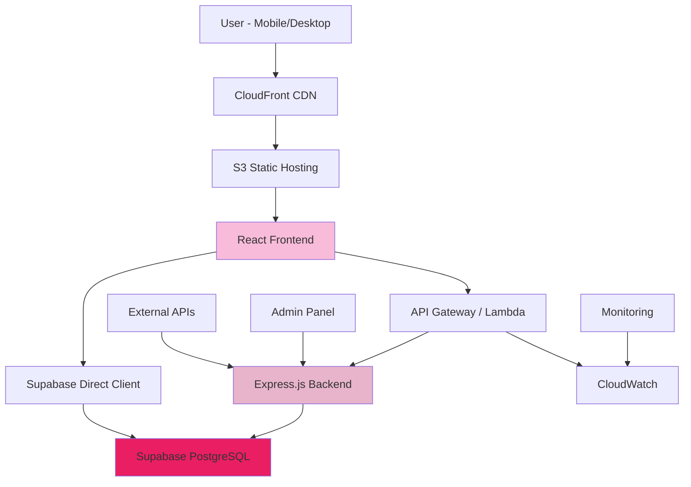
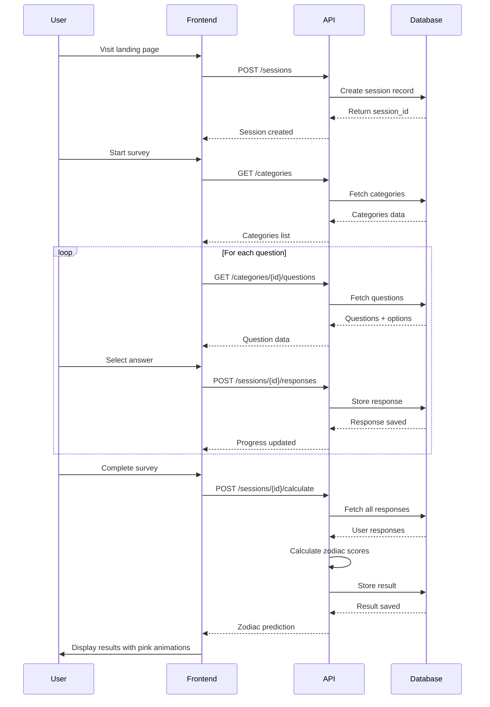
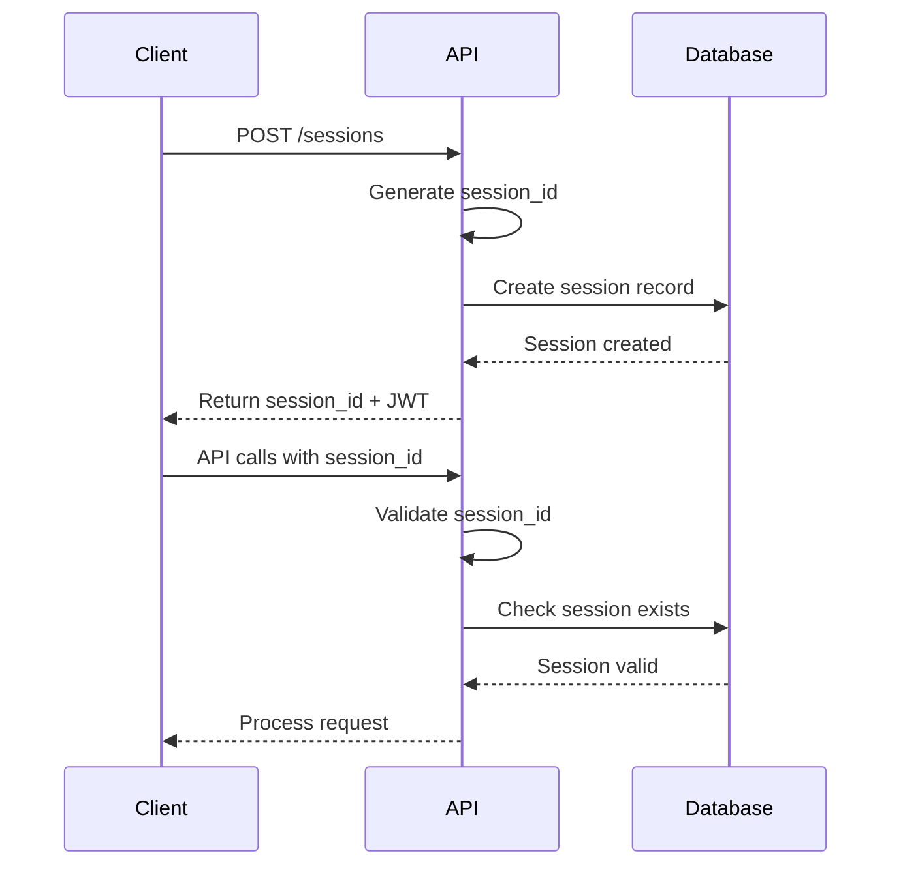
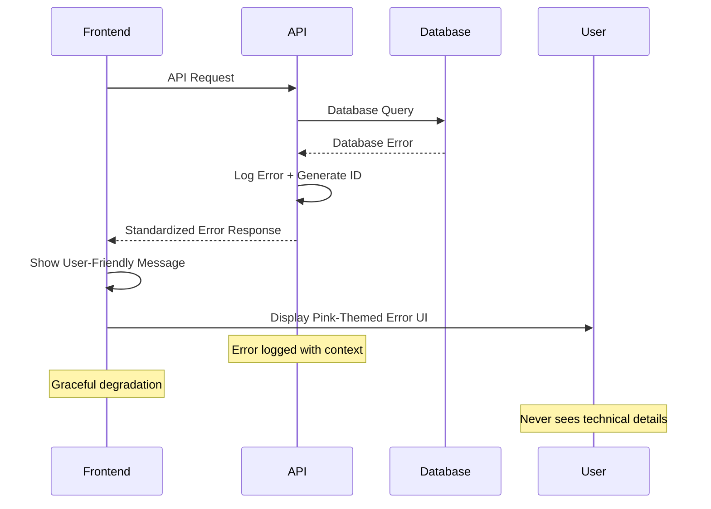

# Zodiac Predictor Fullstack Architecture Document

## Introduction

This document outlines the complete fullstack architecture for Zodiac Predictor,
including backend systems, frontend implementation, and their integration. It
serves as the single source of truth for AI-driven development, ensuring
consistency across the entire technology stack.

This unified approach combines what would traditionally be separate backend and
frontend architecture documents, streamlining the development process for modern
fullstack applications where these concerns are increasingly intertwined.

### Starter Template or Existing Project

**Template Assessment:** For this BMad-Method learning project, we'll evaluate
modern fullstack starter options:

**Recommended Options:**

1. **T3 Stack** - Next.js + TypeScript + tRPC + Prisma (excellent for learning,
   all-in-one)
2. **Vite + React + Express** - Separate frontend/backend for clear learning
   boundaries
3. **Custom Setup** - Manual configuration for maximum BMad learning experience

**Selected Approach:** Custom setup with Vite + React frontend and Express
backend **Rationale:**

- Clear separation helps understand frontend/backend integration
- Maximum learning opportunity for BMad-Method
- Full control over configuration and dependencies
- Easier to follow story-driven development approach

### Change Log

| Date       | Version | Description                    | Author            |
| ---------- | ------- | ------------------------------ | ----------------- |
| 2024-07-24 | 1.0     | Initial fullstack architecture | Architect Winston |

## High Level Architecture

### Technical Summary

Zodiac Predictor employs a modern fullstack architecture with React frontend and
Node.js backend, connected through RESTful APIs and integrated with Supabase for
database operations. The system uses a monorepo structure for efficient
development, with mobile-first responsive design and AWS deployment for
scalability. The architecture prioritizes user experience through optimized
survey flows, real-time progress tracking, and dramatic result presentations
while maintaining excellent performance and SEO capabilities.

### Platform and Infrastructure Choice

**Platform:** AWS + Supabase Hybrid Approach

**Rationale:**

- **AWS**: Industry standard, extensive free tier, excellent learning
  opportunity
- **Supabase**: Rapid development, built-in auth, real-time capabilities,
  PostgreSQL
- **Hybrid Benefits**: Database managed by Supabase, application layer on AWS

**Key Services:**

- **AWS S3 + CloudFront**: Frontend hosting and CDN
- **AWS Lambda**: Serverless backend functions (alternative to EC2)
- **Supabase Database**: PostgreSQL with built-in auth and real-time
- **AWS Route 53**: DNS management
- **AWS Certificate Manager**: SSL certificates

**Deployment Regions:** Primary: us-east-1 (N. Virginia), Secondary: eu-west-1
(Ireland)

### Repository Structure

**Structure:** Monorepo with Workspace Management **Monorepo Tool:** npm
workspaces (built-in, simple, perfect for learning) **Package Organization:**
Clear separation between frontend, backend, and shared code

**Benefits for BMad Learning:**

- Single repository simplifies story development
- Shared types between frontend and backend
- Unified development scripts and tooling
- Easy cross-package refactoring during learning

### Architecture Diagram



### Architectural Patterns

- **Jamstack Architecture:** Static site generation with serverless APIs -
  _Rationale:_ Optimal performance and SEO for content-heavy zodiac descriptions
- **Component-Based UI:** Reusable React components with TypeScript -
  _Rationale:_ Maintainability and type safety across large survey flows
- **Repository Pattern:** Abstract data access logic - _Rationale:_ Clean
  separation between business logic and database operations
- **RESTful API Design:** Standard HTTP methods and resource-based URLs -
  _Rationale:_ Simple to understand and implement for BMad learning
- **Session-Based State Management:** Temporary user data without registration -
  _Rationale:_ Reduces friction while maintaining survey progress

## Tech Stack

### Technology Stack Table

| Category             | Technology      | Version | Purpose                         | Rationale                                                         |
| -------------------- | --------------- | ------- | ------------------------------- | ----------------------------------------------------------------- |
| Frontend Language    | TypeScript      | 5.3.3   | Primary development language    | Strong typing, excellent tooling, catches errors early            |
| Frontend Framework   | React           | 18.2.0  | UI component framework          | Industry standard, excellent ecosystem, great for BMad learning   |
| Frontend Build Tool  | Vite            | 5.0.0   | Build tool and dev server       | Fast development, modern ES modules, excellent TypeScript support |
| UI Component Library | Headless UI     | 1.7.17  | Accessible component primitives | Accessibility built-in, works with Tailwind, unstyled flexibility |
| State Management     | Zustand         | 4.4.7   | Client state management         | Simple API, TypeScript-first, perfect for survey state            |
| Routing              | React Router    | 6.20.1  | Client-side routing             | Standard routing solution, good TypeScript support                |
| Backend Language     | TypeScript      | 5.3.3   | Server development language     | Shared types with frontend, better developer experience           |
| Backend Framework    | Express.js      | 4.18.2  | Web application framework       | Simple, widely used, excellent for learning APIs                  |
| API Style            | REST            | -       | HTTP API design                 | Easy to understand, debug, and test for BMad learning             |
| Database             | Supabase        | 2.38.4  | PostgreSQL database service     | Managed PostgreSQL, built-in auth, real-time subscriptions        |
| ORM/Query Builder    | Supabase Client | 2.38.4  | Database interaction            | Type-safe queries, real-time subscriptions                        |
| Authentication       | Supabase Auth   | 2.38.4  | User session management         | Built-in auth flows, social providers ready                       |
| Frontend Testing     | Vitest          | 1.0.4   | Unit and integration testing    | Fast, Vite-native, excellent TypeScript support                   |
| Backend Testing      | Jest            | 29.7.0  | Backend API testing             | Comprehensive testing framework, great mocking capabilities       |
| E2E Testing          | Playwright      | 1.40.1  | End-to-end testing              | Cross-browser testing, excellent for survey flows                 |
| CSS Framework        | Tailwind CSS    | 3.3.6   | Utility-first styling           | Rapid development, consistent design system, mobile-first         |
| Build Tool           | npm workspaces  | -       | Monorepo management             | Built-in Node.js, simple setup, perfect for learning              |
| IaC Tool             | AWS CDK         | 2.110.1 | Infrastructure as code          | TypeScript-based, versioned infrastructure                        |
| CI/CD                | GitHub Actions  | -       | Automated deployment            | Free for public repos, excellent AWS integration                  |
| Monitoring           | AWS CloudWatch  | -       | Application monitoring          | Built-in AWS monitoring, logs and metrics                         |
| Logging              | Winston         | 3.11.0  | Structured logging              | Flexible logging levels, multiple transports                      |

## Data Models

### Core Survey Data Model

**Purpose:** Manages the complete survey system including questions, categories,
and user responses

**Key Attributes:**

- categories: Organizes questions into logical groups (5 categories)
- questions: Individual survey questions with ordering
- question_options: Multiple choice answers with zodiac scoring
- user_sessions: Temporary user state without registration

**Relationships:**

- Categories → Questions (one-to-many)
- Questions → Question Options (one-to-many)
- Question Options → Zodiac Scoring (one-to-many)
- User Sessions → User Responses (one-to-many)

#### TypeScript Interface

```typescript
interface Category {
  id: string
  name: string
  description: string
  order_index: number
  icon_name?: string
  created_at: Date
}

interface Question {
  id: string
  category_id: string
  question_text: string
  order_index: number
  created_at: Date
}

interface QuestionOption {
  id: string
  question_id: string
  option_text: string
  order_index: number
}

interface ZodiacScoring {
  id: string
  question_option_id: string
  zodiac_sign: ZodiacSign
  score_value: number
}

enum ZodiacSign {
  ARIES = 'aries',
  TAURUS = 'taurus',
  GEMINI = 'gemini',
  CANCER = 'cancer',
  LEO = 'leo',
  VIRGO = 'virgo',
  LIBRA = 'libra',
  SCORPIO = 'scorpio',
  SAGITTARIUS = 'sagittarius',
  CAPRICORN = 'capricorn',
  AQUARIUS = 'aquarius',
  PISCES = 'pisces',
}
```

### User Session Model

**Purpose:** Tracks user progress through survey without requiring registration

**Key Attributes:**

- session_id: Unique identifier for tracking
- progress_data: JSON field for flexible state storage
- ip_address: For basic analytics and abuse prevention
- user_agent: Device/browser information

#### TypeScript Interface

```typescript
interface UserSession {
  id: string
  session_id: string
  ip_address?: string
  user_agent?: string
  progress_data: {
    current_question_index: number
    current_category_id: string
    responses: UserResponse[]
    started_at: Date
    last_activity_at: Date
  }
  created_at: Date
  updated_at: Date
}

interface UserResponse {
  question_id: string
  selected_option_id: string
  answered_at: Date
}
```

### Zodiac Result Model

**Purpose:** Stores calculated zodiac predictions and explanations

#### TypeScript Interface

```typescript
interface ZodiacResult {
  session_id: string
  predicted_sign: ZodiacSign
  confidence_percentage: number
  score_breakdown: { [key in ZodiacSign]: number }
  explanation_text: string
  alternative_signs: ZodiacSign[]
  calculated_at: Date
}
```

## API Specification

### REST API Specification

```yaml
openapi: 3.0.0
info:
  title: Zodiac Predictor API
  version: 1.0.0
  description: RESTful API for zodiac prediction survey application
servers:
  - url: https://api.zodiac-predictor.com/v1
    description: Production server
  - url: http://localhost:3001/api/v1
    description: Development server

paths:
  /categories:
    get:
      summary: Get all survey categories
      responses:
        '200':
          description: List of categories
          content:
            application/json:
              schema:
                type: array
                items:
                  $ref: '#/components/schemas/Category'

  /categories/{categoryId}/questions:
    get:
      summary: Get questions for a specific category
      parameters:
        - in: path
          name: categoryId
          required: true
          schema:
            type: string
      responses:
        '200':
          description: List of questions with options
          content:
            application/json:
              schema:
                type: array
                items:
                  $ref: '#/components/schemas/QuestionWithOptions'

  /sessions:
    post:
      summary: Create new survey session
      requestBody:
        required: true
        content:
          application/json:
            schema:
              type: object
              properties:
                user_agent:
                  type: string
      responses:
        '201':
          description: Session created
          content:
            application/json:
              schema:
                $ref: '#/components/schemas/UserSession'

  /sessions/{sessionId}/responses:
    post:
      summary: Submit answer to question
      parameters:
        - in: path
          name: sessionId
          required: true
          schema:
            type: string
      requestBody:
        required: true
        content:
          application/json:
            schema:
              type: object
              properties:
                question_id:
                  type: string
                selected_option_id:
                  type: string
              required:
                - question_id
                - selected_option_id
      responses:
        '200':
          description: Response recorded
        '400':
          description: Invalid request

  /sessions/{sessionId}/calculate:
    post:
      summary: Calculate zodiac prediction
      parameters:
        - in: path
          name: sessionId
          required: true
          schema:
            type: string
      responses:
        '200':
          description: Zodiac prediction calculated
          content:
            application/json:
              schema:
                $ref: '#/components/schemas/ZodiacResult'

components:
  schemas:
    Category:
      type: object
      properties:
        id:
          type: string
        name:
          type: string
        description:
          type: string
        order_index:
          type: integer
        icon_name:
          type: string

    QuestionWithOptions:
      type: object
      properties:
        id:
          type: string
        question_text:
          type: string
        order_index:
          type: integer
        options:
          type: array
          items:
            $ref: '#/components/schemas/QuestionOption'

    QuestionOption:
      type: object
      properties:
        id:
          type: string
        option_text:
          type: string
        order_index:
          type: integer

    UserSession:
      type: object
      properties:
        id:
          type: string
        session_id:
          type: string
        progress_data:
          type: object

    ZodiacResult:
      type: object
      properties:
        predicted_sign:
          type: string
        confidence_percentage:
          type: number
        score_breakdown:
          type: object
        explanation_text:
          type: string
        alternative_signs:
          type: array
          items:
            type: string
```

## Components

### Frontend Application (React)

**Responsibility:** User interface, survey flow management, result presentation
with pink mystique theme

**Key Interfaces:**

- Survey API client for question retrieval and answer submission
- Session management for progress tracking
- Zodiac calculation API integration
- Responsive UI components with Tailwind CSS

**Dependencies:** React Router, Zustand, Supabase client, Tailwind CSS

**Technology Stack:** React 18 + TypeScript + Vite + Tailwind CSS

### Backend API Service (Express.js)

**Responsibility:** Business logic, survey management, zodiac calculation
algorithms

**Key Interfaces:**

- RESTful API endpoints for frontend consumption
- Supabase database integration
- Session management and validation
- Zodiac scoring algorithm implementation

**Dependencies:** Express.js, Supabase client, validation middleware

**Technology Stack:** Node.js + Express + TypeScript + Supabase

### Database Layer (Supabase)

**Responsibility:** Data persistence, user session management, real-time
capabilities

**Key Interfaces:**

- PostgreSQL database with survey schema
- Built-in authentication (for future features)
- Real-time subscriptions for live updates
- Row Level Security for data protection

**Dependencies:** Supabase managed PostgreSQL

**Technology Stack:** Supabase PostgreSQL + Auth + Realtime

### Shared Types Package

**Responsibility:** TypeScript interfaces shared between frontend and backend

**Key Interfaces:**

- Data model interfaces
- API request/response types
- Survey state management types
- Zodiac calculation types

**Dependencies:** None (pure TypeScript)

**Technology Stack:** TypeScript definitions

## Core Workflows

### Survey Completion Flow



## Database Schema

### PostgreSQL Schema Design

```sql
-- Categories table
CREATE TABLE categories (
    id UUID PRIMARY KEY DEFAULT gen_random_uuid(),
    name VARCHAR(100) NOT NULL,
    description TEXT,
    order_index INTEGER NOT NULL,
    icon_name VARCHAR(50),
    created_at TIMESTAMP WITH TIME ZONE DEFAULT NOW()
);

-- Questions table
CREATE TABLE questions (
    id UUID PRIMARY KEY DEFAULT gen_random_uuid(),
    category_id UUID NOT NULL REFERENCES categories(id),
    question_text TEXT NOT NULL,
    order_index INTEGER NOT NULL,
    created_at TIMESTAMP WITH TIME ZONE DEFAULT NOW()
);

-- Question options table
CREATE TABLE question_options (
    id UUID PRIMARY KEY DEFAULT gen_random_uuid(),
    question_id UUID NOT NULL REFERENCES questions(id),
    option_text TEXT NOT NULL,
    order_index INTEGER NOT NULL
);

-- Zodiac scoring table
CREATE TABLE zodiac_scoring (
    id UUID PRIMARY KEY DEFAULT gen_random_uuid(),
    question_option_id UUID NOT NULL REFERENCES question_options(id),
    zodiac_sign VARCHAR(20) NOT NULL,
    score_value INTEGER NOT NULL DEFAULT 1
);

-- User sessions table
CREATE TABLE user_sessions (
    id UUID PRIMARY KEY DEFAULT gen_random_uuid(),
    session_id VARCHAR(100) UNIQUE NOT NULL,
    ip_address INET,
    user_agent TEXT,
    progress_data JSONB DEFAULT '{}',
    created_at TIMESTAMP WITH TIME ZONE DEFAULT NOW(),
    updated_at TIMESTAMP WITH TIME ZONE DEFAULT NOW()
);

-- User responses table
CREATE TABLE user_responses (
    id UUID PRIMARY KEY DEFAULT gen_random_uuid(),
    session_id VARCHAR(100) NOT NULL REFERENCES user_sessions(session_id),
    question_id UUID NOT NULL REFERENCES questions(id),
    selected_option_id UUID NOT NULL REFERENCES question_options(id),
    answered_at TIMESTAMP WITH TIME ZONE DEFAULT NOW()
);

-- Zodiac results table
CREATE TABLE zodiac_results (
    id UUID PRIMARY KEY DEFAULT gen_random_uuid(),
    session_id VARCHAR(100) NOT NULL REFERENCES user_sessions(session_id),
    predicted_sign VARCHAR(20) NOT NULL,
    confidence_percentage INTEGER NOT NULL,
    score_breakdown JSONB NOT NULL,
    explanation_text TEXT,
    alternative_signs TEXT[],
    calculated_at TIMESTAMP WITH TIME ZONE DEFAULT NOW()
);

-- Indexes for performance
CREATE INDEX idx_questions_category_order ON questions(category_id, order_index);
CREATE INDEX idx_question_options_question ON question_options(question_id);
CREATE INDEX idx_zodiac_scoring_option ON zodiac_scoring(question_option_id);
CREATE INDEX idx_user_responses_session ON user_responses(session_id);
CREATE INDEX idx_user_sessions_created ON user_sessions(created_at);

-- RLS policies for security
ALTER TABLE user_sessions ENABLE ROW LEVEL SECURITY;
ALTER TABLE user_responses ENABLE ROW LEVEL SECURITY;
ALTER TABLE zodiac_results ENABLE ROW LEVEL SECURITY;
```

## Frontend Architecture

### Component Architecture

#### Component Organization

```
src/
├── components/
│   ├── ui/                     # Reusable UI components
│   │   ├── Button.tsx
│   │   ├── Card.tsx
│   │   ├── ProgressBar.tsx
│   │   └── LoadingSpinner.tsx
│   ├── survey/                 # Survey-specific components
│   │   ├── QuestionCard.tsx
│   │   ├── CategoryTransition.tsx
│   │   ├── ProgressTracker.tsx
│   │   └── SurveyFlow.tsx
│   ├── results/                # Results display components
│   │   ├── ZodiacReveal.tsx
│   │   ├── ResultsDetail.tsx
│   │   ├── ShareModal.tsx
│   │   └── AlternativeResults.tsx
│   └── layout/                 # Layout components
│       ├── Header.tsx
│       ├── Footer.tsx
│       └── PageLayout.tsx
├── pages/                      # Page components
│   ├── Landing.tsx
│   ├── Survey.tsx
│   └── Results.tsx
├── hooks/                      # Custom React hooks
│   ├── useSurveyState.ts
│   ├── useZodiacCalculation.ts
│   └── useLocalStorage.ts
└── lib/                        # Utilities and services
    ├── api.ts
    ├── zodiac-calculator.ts
    └── types.ts
```

#### Component Template

```typescript
import React from 'react';
import { cn } from '@/lib/utils';

interface QuestionCardProps {
  question: Question;
  selectedOption?: string;
  onOptionSelect: (optionId: string) => void;
  className?: string;
}

export const QuestionCard: React.FC<QuestionCardProps> = ({
  question,
  selectedOption,
  onOptionSelect,
  className
}) => {
  return (
    <div className={cn(
      'bg-white rounded-xl border-2 border-pink-primary shadow-lg p-6',
      'transition-all duration-300 hover:shadow-pink-primary/20',
      className
    )}>
      <h3 className="text-xl font-medium text-gray-800 mb-6">
        {question.question_text}
      </h3>

      <div className="space-y-3">
        {question.options.map((option) => (
          <button
            key={option.id}
            onClick={() => onOptionSelect(option.id)}
            className={cn(
              'w-full p-4 rounded-lg text-left transition-all duration-200',
              'border-2 hover:border-pink-soft hover:bg-pink-dusty/30',
              selectedOption === option.id
                ? 'border-pink-primary bg-pink-dusty text-pink-deep'
                : 'border-gray-200 bg-white'
            )}
          >
            {option.option_text}
          </button>
        ))}
      </div>
    </div>
  );
};
```

### State Management Architecture

#### State Structure

```typescript
interface SurveyStore {
  // Session management
  sessionId: string | null
  isLoading: boolean
  error: string | null

  // Survey data
  categories: Category[]
  currentCategory: Category | null
  currentQuestion: Question | null
  responses: Record<string, string>

  // Progress tracking
  currentQuestionIndex: number
  totalQuestions: number
  completedCategories: string[]

  // Results
  zodiacResult: ZodiacResult | null
  isCalculating: boolean

  // Actions
  initializeSession: () => Promise<void>
  loadCategories: () => Promise<void>
  loadQuestions: (categoryId: string) => Promise<void>
  submitResponse: (questionId: string, optionId: string) => Promise<void>
  calculateZodiac: () => Promise<void>
  resetSurvey: () => void
}
```

#### State Management Patterns

- **Zustand** for global survey state
- **React Query** for server state management and caching
- **Local Storage** for session persistence
- **Context** for theme and UI preferences

### Routing Architecture

#### Route Organization

```typescript
const router = createBrowserRouter([
  {
    path: '/',
    element: <PageLayout />,
    children: [
      {
        index: true,
        element: <Landing />
      },
      {
        path: 'survey',
        element: <Survey />,
        children: [
          {
            path: ':categoryId',
            element: <SurveyFlow />
          },
          {
            path: 'loading',
            element: <LoadingScreen />
          }
        ]
      },
      {
        path: 'results/:sessionId',
        element: <Results />
      }
    ]
  },
  {
    path: '*',
    element: <NotFound />
  }
]);
```

#### Protected Route Pattern

```typescript
interface ProtectedRouteProps {
  children: React.ReactNode;
  requiresSession?: boolean;
}

export const ProtectedRoute: React.FC<ProtectedRouteProps> = ({
  children,
  requiresSession = false
}) => {
  const { sessionId } = useSurveyStore();

  if (requiresSession && !sessionId) {
    return <Navigate to="/" replace />;
  }

  return <>{children}</>;
};
```

### Frontend Services Layer

#### API Client Setup

```typescript
class ApiClient {
  private baseURL: string

  constructor(baseURL: string) {
    this.baseURL = baseURL
  }

  async get<T>(endpoint: string): Promise<T> {
    const response = await fetch(`${this.baseURL}${endpoint}`, {
      headers: {
        'Content-Type': 'application/json',
      },
    })

    if (!response.ok) {
      throw new Error(`API Error: ${response.statusText}`)
    }

    return response.json()
  }

  async post<T>(endpoint: string, data: unknown): Promise<T> {
    const response = await fetch(`${this.baseURL}${endpoint}`, {
      method: 'POST',
      headers: {
        'Content-Type': 'application/json',
      },
      body: JSON.stringify(data),
    })

    if (!response.ok) {
      throw new Error(`API Error: ${response.statusText}`)
    }

    return response.json()
  }
}

export const apiClient = new ApiClient(
  process.env.NODE_ENV === 'production'
    ? 'https://api.zodiac-predictor.com/v1'
    : 'http://localhost:3001/api/v1'
)
```

#### Service Example

```typescript
export const surveyService = {
  async createSession(): Promise<UserSession> {
    return apiClient.post<UserSession>('/sessions', {
      user_agent: navigator.userAgent,
    })
  },

  async getCategories(): Promise<Category[]> {
    return apiClient.get<Category[]>('/categories')
  },

  async getQuestions(categoryId: string): Promise<Question[]> {
    return apiClient.get<Question[]>(`/categories/${categoryId}/questions`)
  },

  async submitResponse(
    sessionId: string,
    questionId: string,
    optionId: string
  ): Promise<void> {
    return apiClient.post(`/sessions/${sessionId}/responses`, {
      question_id: questionId,
      selected_option_id: optionId,
    })
  },

  async calculateZodiac(sessionId: string): Promise<ZodiacResult> {
    return apiClient.post<ZodiacResult>(`/sessions/${sessionId}/calculate`, {})
  },
}
```

## Backend Architecture

### Service Architecture

#### Controller Organization

```
src/
├── controllers/
│   ├── categories.controller.ts
│   ├── questions.controller.ts
│   ├── sessions.controller.ts
│   └── zodiac.controller.ts
├── services/
│   ├── survey.service.ts
│   ├── zodiac-calculation.service.ts
│   └── session.service.ts
├── models/
│   ├── category.model.ts
│   ├── question.model.ts
│   ├── session.model.ts
│   └── zodiac.model.ts
├── middleware/
│   ├── auth.middleware.ts
│   ├── validation.middleware.ts
│   └── error.middleware.ts
├── routes/
│   ├── api.routes.ts
│   └── health.routes.ts
└── utils/
    ├── database.ts
    ├── logger.ts
    └── constants.ts
```

#### Controller Template

```typescript
import { Request, Response, NextFunction } from 'express'
import { surveyService } from '../services/survey.service'
import { ApiResponse } from '../types/api.types'

export class CategoriesController {
  async getCategories(
    req: Request,
    res: Response<ApiResponse<Category[]>>,
    next: NextFunction
  ) {
    try {
      const categories = await surveyService.getAllCategories()

      res.json({
        success: true,
        data: categories,
        message: 'Categories retrieved successfully',
      })
    } catch (error) {
      next(error)
    }
  }

  async getCategoryQuestions(
    req: Request,
    res: Response<ApiResponse<Question[]>>,
    next: NextFunction
  ) {
    try {
      const { categoryId } = req.params
      const questions = await surveyService.getQuestionsByCategory(categoryId)

      res.json({
        success: true,
        data: questions,
        message: 'Questions retrieved successfully',
      })
    } catch (error) {
      next(error)
    }
  }
}
```

### Database Architecture

#### Schema Design

The database schema is designed for optimal query performance and data
integrity:

```sql
-- Optimized queries for frequent operations
-- 1. Loading questions by category (most common)
SELECT q.*, array_agg(
  json_build_object(
    'id', qo.id,
    'option_text', qo.option_text,
    'order_index', qo.order_index
  ) ORDER BY qo.order_index
) as options
FROM questions q
LEFT JOIN question_options qo ON q.id = qo.question_id
WHERE q.category_id = $1
GROUP BY q.id
ORDER BY q.order_index;

-- 2. Calculating zodiac scores (performance critical)
SELECT
  zs.zodiac_sign,
  SUM(zs.score_value) as total_score
FROM user_responses ur
JOIN zodiac_scoring zs ON ur.selected_option_id = zs.question_option_id
WHERE ur.session_id = $1
GROUP BY zs.zodiac_sign
ORDER BY total_score DESC;
```

#### Data Access Layer

```typescript
export class SurveyRepository {
  private supabase: SupabaseClient

  constructor(supabase: SupabaseClient) {
    this.supabase = supabase
  }

  async getCategories(): Promise<Category[]> {
    const { data, error } = await this.supabase
      .from('categories')
      .select('*')
      .order('order_index')

    if (error) throw error
    return data
  }

  async getQuestionsByCategory(categoryId: string): Promise<Question[]> {
    const { data, error } = await this.supabase
      .from('questions')
      .select(
        `
        *,
        question_options (
          id,
          option_text,
          order_index
        )
      `
      )
      .eq('category_id', categoryId)
      .order('order_index')

    if (error) throw error
    return data
  }

  async saveUserResponse(
    sessionId: string,
    questionId: string,
    optionId: string
  ): Promise<void> {
    const { error } = await this.supabase.from('user_responses').insert({
      session_id: sessionId,
      question_id: questionId,
      selected_option_id: optionId,
    })

    if (error) throw error
  }
}
```

### Auth Architecture

#### Session Management Flow



#### Middleware/Guards

```typescript
export const sessionValidation = async (
  req: Request,
  res: Response,
  next: NextFunction
) => {
  try {
    const sessionId = req.headers['x-session-id'] as string

    if (!sessionId) {
      return res.status(401).json({
        success: false,
        message: 'Session ID required',
      })
    }

    const { data: session } = await supabase
      .from('user_sessions')
      .select('*')
      .eq('session_id', sessionId)
      .single()

    if (!session) {
      return res.status(401).json({
        success: false,
        message: 'Invalid session',
      })
    }

    req.session = session
    next()
  } catch (error) {
    next(error)
  }
}
```

## Unified Project Structure

```
zodiac-predictor/
├── .github/                    # CI/CD workflows
│   └── workflows/
│       ├── ci.yaml            # Test and build
│       └── deploy.yaml        # AWS deployment
├── apps/                       # Application packages
│   ├── web/                    # Frontend application (React)
│   │   ├── src/
│   │   │   ├── components/     # UI components with pink theme
│   │   │   │   ├── ui/         # Base UI components
│   │   │   │   ├── survey/     # Survey-specific components
│   │   │   │   ├── results/    # Results display components
│   │   │   │   └── layout/     # Layout components
│   │   │   ├── pages/          # Page components/routes
│   │   │   │   ├── Landing.tsx
│   │   │   │   ├── Survey.tsx
│   │   │   │   └── Results.tsx
│   │   │   ├── hooks/          # Custom React hooks
│   │   │   │   ├── useSurveyState.ts
│   │   │   │   ├── useZodiacCalculation.ts
│   │   │   │   └── useLocalStorage.ts
│   │   │   ├── services/       # API client services
│   │   │   │   ├── api.client.ts
│   │   │   │   ├── survey.service.ts
│   │   │   │   └── zodiac.service.ts
│   │   │   ├── stores/         # Zustand state management
│   │   │   │   ├── survey.store.ts
│   │   │   │   └── ui.store.ts
│   │   │   ├── styles/         # Global styles/themes
│   │   │   │   ├── globals.css
│   │   │   │   └── pink-theme.css
│   │   │   ├── lib/            # Utilities and helpers
│   │   │   │   ├── utils.ts
│   │   │   │   ├── constants.ts
│   │   │   │   └── zodiac-data.ts
│   │   │   └── types/          # TypeScript type definitions
│   │   │       ├── survey.types.ts
│   │   │       ├── zodiac.types.ts
│   │   │       └── api.types.ts
│   │   ├── public/             # Static assets
│   │   │   ├── icons/          # Zodiac and UI icons
│   │   │   ├── images/         # Mystical backgrounds
│   │   │   └── favicon.ico
│   │   ├── tests/              # Frontend tests
│   │   │   ├── components/     # Component tests
│   │   │   ├── hooks/          # Hook tests
│   │   │   └── e2e/            # End-to-end tests
│   │   ├── index.html
│   │   ├── vite.config.ts
│   │   ├── tailwind.config.ts  # Pink theme configuration
│   │   ├── tsconfig.json
│   │   └── package.json
│   └── api/                    # Backend application (Express)
│       ├── src/
│       │   ├── controllers/    # HTTP request handlers
│       │   │   ├── categories.controller.ts
│       │   │   ├── questions.controller.ts
│       │   │   ├── sessions.controller.ts
│       │   │   └── zodiac.controller.ts
│       │   ├── services/       # Business logic
│       │   │   ├── survey.service.ts
│       │   │   ├── zodiac-calculation.service.ts
│       │   │   ├── session.service.ts
│       │   │   └── data-seeding.service.ts
│       │   ├── models/         # Data models and repositories
│       │   │   ├── category.model.ts
│       │   │   ├── question.model.ts
│       │   │   ├── session.model.ts
│       │   │   └── zodiac.model.ts
│       │   ├── middleware/     # Express middleware
│       │   │   ├── auth.middleware.ts
│       │   │   ├── validation.middleware.ts
│       │   │   ├── error.middleware.ts
│       │   │   └── cors.middleware.ts
│       │   ├── routes/         # API route definitions
│       │   │   ├── api.routes.ts
│       │   │   ├── health.routes.ts
│       │   │   └── admin.routes.ts
│       │   ├── utils/          # Backend utilities
│       │   │   ├── database.ts
│       │   │   ├── logger.ts
│       │   │   ├── constants.ts
│       │   │   └── validation.ts
│       │   ├── types/          # Shared TypeScript types
│       │   │   ├── api.types.ts
│       │   │   ├── database.types.ts
│       │   │   └── zodiac.types.ts
│       │   └── app.ts          # Express app configuration
│       ├── tests/              # Backend tests
│       │   ├── unit/           # Unit tests
│       │   ├── integration/    # Integration tests
│       │   └── fixtures/       # Test data
│       ├── database/           # Database migrations and seeds
│       │   ├── migrations/     # SQL migration files
│       │   ├── seeds/          # Initial data seeding
│       │   └── schema.sql      # Complete schema definition
│       ├── tsconfig.json
│       └── package.json
├── packages/                   # Shared packages
│   ├── shared/                 # Shared types/utilities
│   │   ├── src/
│   │   │   ├── types/          # TypeScript interfaces
│   │   │   │   ├── survey.types.ts
│   │   │   │   ├── zodiac.types.ts
│   │   │   │   ├── api.types.ts
│   │   │   │   └── index.ts
│   │   │   ├── constants/      # Shared constants
│   │   │   │   ├── zodiac.constants.ts
│   │   │   │   ├── api.constants.ts
│   │   │   │   └── index.ts
│   │   │   ├── utils/          # Shared utilities
│   │   │   │   ├── zodiac-calculator.ts
│   │   │   │   ├── validation.ts
│   │   │   │   └── index.ts
│   │   │   └── index.ts        # Main export file
│   │   ├── tsconfig.json
│   │   └── package.json
│   └── ui-components/          # Shared UI components (future)
│       ├── src/
│       │   ├── Button.tsx      # Pink-themed button
│       │   ├── Card.tsx        # Mystical card component
│       │   └── index.ts
│       ├── tsconfig.json
│       └── package.json
├── infrastructure/             # AWS CDK infrastructure code
│   ├── lib/
│   │   ├── frontend-stack.ts   # S3 + CloudFront
│   │   ├── backend-stack.ts    # Lambda + API Gateway
│   │   └── database-stack.ts   # Supabase integration
│   ├── bin/
│   │   └── app.ts             # CDK app entry point
│   ├── cdk.json
│   └── package.json
├── scripts/                    # Build/deploy scripts
│   ├── build.sh               # Build all packages
│   ├── deploy.sh              # Deploy to AWS
│   ├── test.sh                # Run all tests
│   └── seed-data.sh           # Seed database
├── docs/                       # Documentation
│   ├── project-brief.md
│   ├── prd.md
│   ├── front-end-spec.md
│   └── fullstack-architecture.md
├── .env.example                # Environment template
├── .gitignore
├── package.json                # Root package.json with workspaces
├── tsconfig.json               # Root TypeScript config
├── lerna.json                  # Workspace configuration
└── README.md
```

## Development Workflow

### Local Development Setup

#### Prerequisites

```bash
# Required software
node --version    # v20.11.0 or higher
npm --version     # v10.0.0 or higher
git --version     # v2.34.0 or higher

# Optional but recommended
docker --version  # For local database if needed
```

#### Initial Setup

```bash
# Clone repository
git clone <repository-url>
cd zodiac-predictor

# Install dependencies for all packages
npm install

# Set up environment variables
cp .env.example .env
# Edit .env with your Supabase credentials

# Set up database schema
npm run db:migrate
npm run db:seed

# Verify installation
npm run test
```

#### Development Commands

```bash
# Start all services (frontend + backend)
npm run dev

# Start frontend only (React dev server)
npm run dev:web

# Start backend only (Express server)
npm run dev:api

# Run tests across all packages
npm test

# Build production bundles
npm run build

# Type checking
npm run type-check

# Linting and formatting
npm run lint
npm run format
```

### Environment Configuration

#### Required Environment Variables

```bash
# Frontend (.env.local in apps/web)
VITE_API_URL=http://localhost:3001/api/v1
VITE_SUPABASE_URL=your_supabase_project_url
VITE_SUPABASE_ANON_KEY=your_supabase_anon_key
VITE_APP_ENV=development

# Backend (.env in apps/api)
PORT=3001
NODE_ENV=development
SUPABASE_URL=your_supabase_project_url
SUPABASE_SERVICE_KEY=your_supabase_service_key
CORS_ORIGIN=http://localhost:5173
SESSION_SECRET=your_random_session_secret

# Shared (root .env)
DATABASE_URL=your_supabase_connection_string
AWS_REGION=us-east-1
AWS_ACCOUNT_ID=your_aws_account_id
```

## Deployment Architecture

### Deployment Strategy

**Frontend Deployment:**

- **Platform:** AWS S3 + CloudFront
- **Build Command:** `npm run build:web`
- **Output Directory:** `apps/web/dist`
- **CDN/Edge:** CloudFront with pink-themed assets optimization

**Backend Deployment:**

- **Platform:** AWS Lambda + API Gateway
- **Build Command:** `npm run build:api`
- **Deployment Method:** AWS CDK with serverless functions

### CI/CD Pipeline

```yaml
# .github/workflows/deploy.yaml
name: Deploy to AWS

on:
  push:
    branches: [main]

jobs:
  test:
    runs-on: ubuntu-latest
    steps:
      - uses: actions/checkout@v4
      - uses: actions/setup-node@v4
        with:
          node-version: '20'
          cache: 'npm'

      - run: npm ci
      - run: npm run lint
      - run: npm run type-check
      - run: npm test
      - run: npm run build

  deploy:
    needs: test
    runs-on: ubuntu-latest
    steps:
      - uses: actions/checkout@v4
      - uses: actions/setup-node@v4
        with:
          node-version: '20'
          cache: 'npm'

      - run: npm ci
      - run: npm run build

      # Deploy frontend to S3
      - name: Deploy Frontend
        run: |
          aws s3 sync apps/web/dist s3://${{ secrets.S3_BUCKET }} --delete
          aws cloudfront create-invalidation --distribution-id ${{ secrets.CLOUDFRONT_ID }} --paths "/*"
        env:
          AWS_ACCESS_KEY_ID: ${{ secrets.AWS_ACCESS_KEY_ID }}
          AWS_SECRET_ACCESS_KEY: ${{ secrets.AWS_SECRET_ACCESS_KEY }}

      # Deploy backend with CDK
      - name: Deploy Backend
        run: |
          cd infrastructure
          npm run cdk deploy --require-approval never
        env:
          AWS_ACCESS_KEY_ID: ${{ secrets.AWS_ACCESS_KEY_ID }}
          AWS_SECRET_ACCESS_KEY: ${{ secrets.AWS_SECRET_ACCESS_KEY }}
```

### Environments

| Environment | Frontend URL                         | Backend URL                              | Purpose                               |
| ----------- | ------------------------------------ | ---------------------------------------- | ------------------------------------- |
| Development | http://localhost:5173                | http://localhost:3001                    | Local development with hot reload     |
| Staging     | https://staging.zodiac-predictor.com | https://api-staging.zodiac-predictor.com | Pre-production testing and validation |
| Production  | https://zodiac-predictor.com         | https://api.zodiac-predictor.com         | Live environment for users            |

## Security and Performance

### Security Requirements

**Frontend Security:**

- CSP Headers:
  `default-src 'self'; style-src 'self' 'unsafe-inline'; script-src 'self'`
- XSS Prevention: React's built-in XSS protection + input sanitization
- Secure Storage: Session data in httpOnly cookies, no sensitive data in
  localStorage

**Backend Security:**

- Input Validation: Joi schema validation for all API endpoints
- Rate Limiting: 100 requests per minute per IP, 1000 per day per session
- CORS Policy: Restricted to frontend domain origins only

**Authentication Security:**

- Token Storage: Short-lived JWT tokens in httpOnly cookies
- Session Management: Server-side session validation with Supabase
- Password Policy: N/A (no user accounts in MVP, session-based only)

### Performance Optimization

**Frontend Performance:**

- Bundle Size Target: <500KB initial bundle, <200KB per route
- Loading Strategy: Code splitting by route + component-level lazy loading
- Caching Strategy: Service Worker for static assets, React Query for API
  caching

**Backend Performance:**

- Response Time Target: <200ms for API endpoints, <500ms for zodiac calculation
- Database Optimization: Indexed queries, prepared statements, connection
  pooling
- Caching Strategy: Redis for session data, Supabase built-in query caching

## Testing Strategy

### Testing Pyramid

```
            E2E Tests (Playwright)
           /                  \
      Integration Tests         \
     /              \           \
Frontend Unit    Backend Unit    \
   (Vitest)        (Jest)         \
```

### Test Organization

#### Frontend Tests

```
apps/web/tests/
├── components/          # Component unit tests
│   ├── QuestionCard.test.tsx
│   ├── ProgressBar.test.tsx
│   └── ZodiacReveal.test.tsx
├── hooks/              # Custom hook tests
│   ├── useSurveyState.test.ts
│   └── useZodiacCalculation.test.ts
├── services/           # API service tests
│   ├── api.client.test.ts
│   └── survey.service.test.ts
└── e2e/               # End-to-end tests
    ├── survey-flow.spec.ts
    ├── zodiac-calculation.spec.ts
    └── mobile-experience.spec.ts
```

#### Backend Tests

```
apps/api/tests/
├── unit/              # Unit tests
│   ├── services/
│   │   ├── zodiac-calculation.test.ts
│   │   └── survey.service.test.ts
│   └── controllers/
│       ├── sessions.controller.test.ts
│       └── zodiac.controller.test.ts
├── integration/       # Integration tests
│   ├── api/
│   │   ├── survey-flow.test.ts
│   │   └── zodiac-calculation.test.ts
│   └── database/
│       └── repository.test.ts
└── fixtures/          # Test data
    ├── sample-responses.json
    └── zodiac-scores.json
```

### Test Examples

#### Frontend Component Test

```typescript
import { render, screen, fireEvent } from '@testing-library/react';
import { QuestionCard } from '@/components/survey/QuestionCard';

const mockQuestion = {
  id: '1',
  question_text: 'What do you do first when you wake up?',
  options: [
    { id: 'opt1', option_text: 'Drink water', order_index: 0 },
    { id: 'opt2', option_text: 'Check phone', order_index: 1 }
  ]
};

test('renders question and handles option selection', () => {
  const onSelect = jest.fn();

  render(
    <QuestionCard
      question={mockQuestion}
      onOptionSelect={onSelect}
    />
  );

  expect(screen.getByText('What do you do first when you wake up?')).toBeInTheDocument();

  fireEvent.click(screen.getByText('Drink water'));
  expect(onSelect).toHaveBeenCalledWith('opt1');
});
```

#### Backend API Test

```typescript
import request from 'supertest'
import { app } from '../src/app'

describe('POST /api/v1/sessions/:id/calculate', () => {
  it('should calculate zodiac prediction correctly', async () => {
    const sessionId = 'test-session-123'

    // Seed test responses
    await seedTestResponses(sessionId)

    const response = await request(app)
      .post(`/api/v1/sessions/${sessionId}/calculate`)
      .expect(200)

    expect(response.body.success).toBe(true)
    expect(response.body.data.predicted_sign).toBeDefined()
    expect(response.body.data.confidence_percentage).toBeGreaterThan(0)
  })
})
```

#### E2E Test

```typescript
import { test, expect } from '@playwright/test'

test('complete survey flow', async ({ page }) => {
  await page.goto('/')

  // Start survey
  await page.click('text=Sihri Başlat')

  // Answer questions in first category
  for (let i = 0; i < 10; i++) {
    await page.click('[data-testid="option-1"]')
    await page.click('text=İleri')
  }

  // Continue through all categories
  await page.waitForSelector('[data-testid="loading-screen"]')

  // Verify results page
  await expect(page.locator('[data-testid="zodiac-result"]')).toBeVisible()
  await expect(page.locator('text=%')).toBeVisible() // Confidence percentage
})
```

## Coding Standards

### Critical Fullstack Rules

- **Type Sharing:** Always define types in packages/shared and import from
  there - _Never duplicate interfaces between frontend and backend_
- **API Calls:** Never make direct HTTP calls - use the service layer with
  proper error handling and loading states
- **Environment Variables:** Access only through config objects, never
  process.env directly - _Use validated configuration schemas_
- **Error Handling:** All API routes must use the standard error handler
  middleware - _Consistent error responses across all endpoints_
- **State Updates:** Never mutate state directly - use proper state management
  patterns (Zustand actions, immutable updates)

### Naming Conventions

| Element         | Frontend             | Backend         | Example                      |
| --------------- | -------------------- | --------------- | ---------------------------- |
| Components      | PascalCase           | -               | `QuestionCard.tsx`           |
| Hooks           | camelCase with 'use' | -               | `useSurveyState.ts`          |
| API Routes      | -                    | kebab-case      | `/api/v1/zodiac-calculation` |
| Database Tables | -                    | snake_case      | `zodiac_scoring`             |
| Functions       | camelCase            | camelCase       | `calculateZodiac()`          |
| Constants       | SCREAMING_SNAKE      | SCREAMING_SNAKE | `ZODIAC_SIGNS`               |

## Error Handling Strategy

### Error Flow



### Error Response Format

```typescript
interface ApiError {
  success: false;
  error: {
    code: string;
    message: string;
    details?: Record<string, any>;
    timestamp: string;
    requestId: string;
  };
}

// Example error responses
{
  "success": false,
  "error": {
    "code": "INVALID_SESSION",
    "message": "Your session has expired. Please start a new survey.",
    "timestamp": "2024-07-24T15:30:00Z",
    "requestId": "req_abc123"
  }
}
```

### Frontend Error Handling

```typescript
export class ApiErrorHandler {
  static handleError(error: ApiError): UserFriendlyError {
    const errorMap: Record<string, UserFriendlyError> = {
      INVALID_SESSION: {
        title: 'Oops! Session Expired',
        message: "Your magical session has ended. Let's start fresh!",
        action: 'restart',
        severity: 'warning',
      },
      CALCULATION_FAILED: {
        title: 'Cosmic Interference',
        message: 'The stars are a bit cloudy right now. Try again?',
        action: 'retry',
        severity: 'error',
      },
      NETWORK_ERROR: {
        title: 'Connection Trouble',
        message: 'Check your internet and try again.',
        action: 'retry',
        severity: 'error',
      },
    }

    return (
      errorMap[error.error.code] || {
        title: 'Something Went Wrong',
        message: 'Our mystical powers need a moment to recharge.',
        action: 'contact',
        severity: 'error',
      }
    )
  }
}
```

### Backend Error Handling

```typescript
export const errorHandler = (
  error: Error,
  req: Request,
  res: Response,
  next: NextFunction
) => {
  const requestId = req.headers['x-request-id'] || generateRequestId()

  logger.error('API Error:', {
    error: error.message,
    stack: error.stack,
    requestId,
    method: req.method,
    url: req.url,
    userAgent: req.headers['user-agent'],
    timestamp: new Date().toISOString(),
  })

  if (error instanceof ValidationError) {
    return res.status(400).json({
      success: false,
      error: {
        code: 'VALIDATION_ERROR',
        message: 'Please check your input and try again.',
        details: error.details,
        timestamp: new Date().toISOString(),
        requestId,
      },
    })
  }

  // Generic server error
  res.status(500).json({
    success: false,
    error: {
      code: 'INTERNAL_ERROR',
      message: 'Something went wrong on our end. Please try again.',
      timestamp: new Date().toISOString(),
      requestId,
    },
  })
}
```

## Monitoring and Observability

### Monitoring Stack

- **Frontend Monitoring:** React Error Boundary + Sentry for error tracking
- **Backend Monitoring:** AWS CloudWatch + Winston logging
- **Error Tracking:** Sentry for both frontend and backend errors
- **Performance Monitoring:** Web Vitals for frontend, CloudWatch metrics for
  backend

### Key Metrics

**Frontend Metrics:**

- Core Web Vitals (LCP, FID, CLS)
- Survey completion rate by step
- Time spent per question category
- Mobile vs desktop usage patterns
- Pink theme engagement metrics

**Backend Metrics:**

- API response times by endpoint
- Database query performance
- Zodiac calculation accuracy
- Session creation/completion rates
- Error rates by error type

## Checklist Results Report

Architecture checklist not yet executed. After completing the architecture
document, run the architect-checklist for comprehensive validation.
