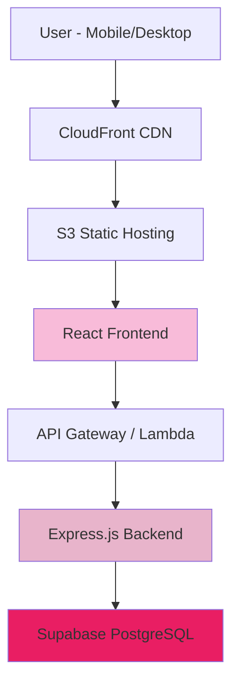

# Architecture Overview - Zodiac Predictor

## Introduction

This document outlines the high-level architecture approach for Zodiac
Predictor, serving as the entry point for the complete architectural
documentation.

### Architecture Shards Structure

This architectural documentation is split into focused shards:

- **architecture-overview.md** (this file) - High-level decisions and platform
  choices
- **architecture-frontend.md** - React frontend architecture, components, and
  state management
- **architecture-backend.md** - Node.js backend services, API design, and
  business logic
- **architecture-database.md** - Database schema, migrations, and data flow
- **architecture-deployment.md** - AWS deployment, infrastructure, and
  monitoring

### Starter Template Decision

**Selected Approach:** Custom setup with Vite + React frontend and Express
backend

**Rationale:**

- Clear separation helps understand frontend/backend integration
- Maximum learning opportunity for BMad-Method
- Full control over configuration and dependencies
- Easier to follow story-driven development approach

### High Level Architecture

**Technical Summary:** Zodiac Predictor employs a modern fullstack architecture
with React frontend and Node.js backend, connected through RESTful APIs and
integrated with Supabase for database operations. The system uses a monorepo
structure for efficient development, with mobile-first responsive design and AWS
deployment for scalability.

### Platform Choice

**Platform:** AWS + Supabase Hybrid Approach

**Key Services:**

- **AWS S3 + CloudFront**: Frontend hosting and CDN
- **AWS Lambda**: Serverless backend functions
- **Supabase Database**: PostgreSQL with built-in auth
- **AWS Route 53**: DNS management

### Repository Structure

**Structure:** Monorepo with npm workspaces **Benefits for BMad Learning:**

- Single repository simplifies story development
- Shared types between frontend and backend
- Unified development scripts and tooling

### Architecture Diagram

### Architectural Patterns

- **Jamstack Architecture** - Static site generation with serverless APIs
- **Component-Based UI** - Reusable React components with TypeScript
- **Repository Pattern** - Abstract data access logic
- **RESTful API Design** - Standard HTTP methods and resource-based URLs
- **Session-Based State** - Temporary user data without registration

## Next Steps

Review the specific architecture shards for detailed implementation guidance:

1. Start with `architecture-frontend.md` for UI development
2. Follow with `architecture-backend.md` for API development
3. Implement database schema from `architecture-database.md`
4. Deploy using `architecture-deployment.md` guidance
