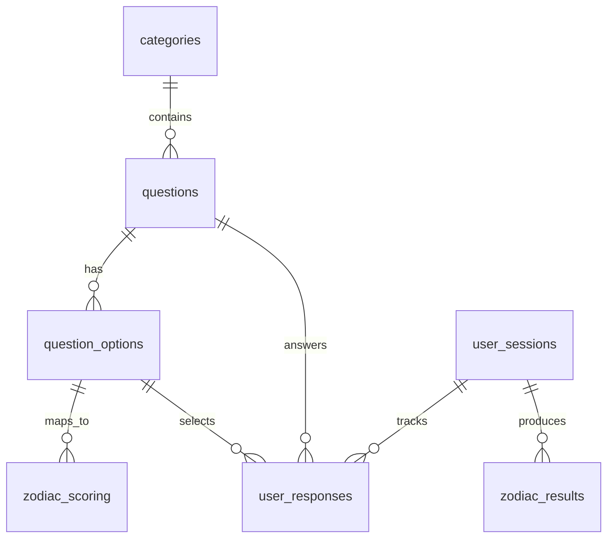

# Database Schema - Zodiac Predictor

## PostgreSQL Schema Design

### Core Tables

#### Categories Table

```sql
CREATE TABLE categories (
    id UUID PRIMARY KEY DEFAULT gen_random_uuid(),
    name VARCHAR(100) NOT NULL,
    description TEXT,
    order_index INTEGER NOT NULL,
    icon_name VARCHAR(50),
    created_at TIMESTAMP WITH TIME ZONE DEFAULT NOW()
);
```

**Purpose:** Organize questions into logical categories (Daily Routines, Social
Behavior, etc.)

#### Questions Table

```sql
CREATE TABLE questions (
    id UUID PRIMARY KEY DEFAULT gen_random_uuid(),
    category_id UUID NOT NULL REFERENCES categories(id),
    question_text TEXT NOT NULL,
    order_index INTEGER NOT NULL,
    created_at TIMESTAMP WITH TIME ZONE DEFAULT NOW()
);
```

**Purpose:** Store individual survey questions with category association

#### Question Options Table

```sql
CREATE TABLE question_options (
    id UUID PRIMARY KEY DEFAULT gen_random_uuid(),
    question_id UUID NOT NULL REFERENCES questions(id),
    option_text TEXT NOT NULL,
    order_index INTEGER NOT NULL
);
```

**Purpose:** Multiple choice answers for each question

#### Zodiac Scoring Table

```sql
CREATE TABLE zodiac_scoring (
    id UUID PRIMARY KEY DEFAULT gen_random_uuid(),
    question_option_id UUID NOT NULL REFERENCES question_options(id),
    zodiac_sign VARCHAR(20) NOT NULL,
    score_value INTEGER NOT NULL DEFAULT 1
);
```

**Purpose:** Map each answer option to zodiac signs with weighted scores

### Session Management Tables

#### User Sessions Table

```sql
CREATE TABLE user_sessions (
    id UUID PRIMARY KEY DEFAULT gen_random_uuid(),
    session_id VARCHAR(100) UNIQUE NOT NULL,
    ip_address INET,
    user_agent TEXT,
    progress_data JSONB DEFAULT '{}',
    created_at TIMESTAMP WITH TIME ZONE DEFAULT NOW(),
    updated_at TIMESTAMP WITH TIME ZONE DEFAULT NOW()
);
```

**Purpose:** Track user survey sessions without requiring registration

#### User Responses Table

```sql
CREATE TABLE user_responses (
    id UUID PRIMARY KEY DEFAULT gen_random_uuid(),
    session_id VARCHAR(100) NOT NULL REFERENCES user_sessions(session_id),
    question_id UUID NOT NULL REFERENCES questions(id),
    selected_option_id UUID NOT NULL REFERENCES question_options(id),
    answered_at TIMESTAMP WITH TIME ZONE DEFAULT NOW()
);
```

**Purpose:** Store user's answers to survey questions

#### Zodiac Results Table

```sql
CREATE TABLE zodiac_results (
    id UUID PRIMARY KEY DEFAULT gen_random_uuid(),
    session_id VARCHAR(100) NOT NULL REFERENCES user_sessions(session_id),
    predicted_sign VARCHAR(20) NOT NULL,
    confidence_score DECIMAL(5,2) NOT NULL,
    alternative_signs JSONB DEFAULT '[]',
    calculation_details JSONB DEFAULT '{}',
    created_at TIMESTAMP WITH TIME ZONE DEFAULT NOW()
);
```

**Purpose:** Store calculated zodiac predictions and metadata

## Data Relationships



## Sample Data Structure

### Categories Data

```sql
INSERT INTO categories (name, description, order_index, icon_name) VALUES
('Günlük Rutinler', 'Sabah alışkanlıkları ve günlük yaşam patterns', 1, 'sunrise'),
('Sosyal Davranışlar', 'İnsan ilişkileri ve sosyal etkileşimler', 2, 'users'),
('Yemek & Tercihler', 'Yemek tercihleri ve yaşam tarzı', 3, 'utensils'),
('Karar Verme Tarzı', 'Problem solving ve seçim yapma patterns', 4, 'brain'),
('Yaratıcılık & Hobiler', 'Sanatsal eğilimler ve ilgi alanları', 5, 'palette');
```

### Zodiac Signs Reference

```sql
-- Zodiac signs enum values
-- Koç, Boğa, İkizler, Yengeç, Aslan, Başak, Terazi, Akrep, Yay, Oğlak, Kova, Balık
```

## Database Indexes

### Performance Indexes

```sql
-- Query optimization indexes
CREATE INDEX idx_questions_category_order ON questions(category_id, order_index);
CREATE INDEX idx_question_options_question ON question_options(question_id, order_index);
CREATE INDEX idx_zodiac_scoring_option ON zodiac_scoring(question_option_id);
CREATE INDEX idx_user_responses_session ON user_responses(session_id);
CREATE INDEX idx_user_sessions_session_id ON user_sessions(session_id);
```

### Composite Indexes

```sql
-- Complex query optimization
CREATE INDEX idx_responses_session_question ON user_responses(session_id, question_id);
CREATE INDEX idx_scoring_option_sign ON zodiac_scoring(question_option_id, zodiac_sign);
```

## Migration Strategy

### Migration Files Structure

```
migrations/
├── 001_create_categories.sql
├── 002_create_questions.sql
├── 003_create_question_options.sql
├── 004_create_zodiac_scoring.sql
├── 005_create_user_sessions.sql
├── 006_create_user_responses.sql
├── 007_create_zodiac_results.sql
├── 008_create_indexes.sql
└── 009_seed_initial_data.sql
```

### Seed Data Requirements

- 5 categories with descriptions and icons
- 50+ questions distributed across categories
- 3-4 answer options per question
- Zodiac scoring matrix for all answer options
- Sample test data for development

## Data Validation Rules

### Business Rules

- Each question must belong to exactly one category
- Each question must have 2-4 answer options
- Each answer option must map to at least one zodiac sign
- Session IDs must be unique and secure
- User can only have one response per question per session

### Data Integrity

- Foreign key constraints enforce referential integrity
- NOT NULL constraints on required fields
- Check constraints for valid score values (1-10 range)
- Unique constraints prevent duplicate responses

## Performance Considerations

### Query Optimization

- Category-based question fetching optimized with indexes
- Session-based response retrieval cached
- Zodiac calculation queries pre-optimized
- Bulk operations for data seeding

### Scalability Planning

- UUID primary keys for horizontal scaling
- JSONB for flexible metadata storage
- Prepared statements and connection pooling
- Database partitioning considerations for large datasets
